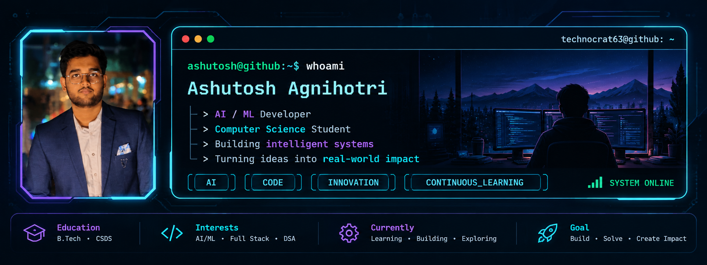

<div align="center">



<br/><br/>

<a href="https://www.linkedin.com/in/ashutosh-agnihotri-8993bb315">
  
</a>
&nbsp;
<a href="mailto:agnihotriashutosh108@gmail.com">
  
</a>

</div>

<br/>

## 👨‍💻 About Me

Hi! I'm **Ashutosh Agnihotri**, a Computer Science student and AI/ML enthusiast who enjoys building intelligent systems and solving real-world problems through technology.

I enjoy working across:

- 🤖 Artificial Intelligence & Machine Learning
- 👁️ Computer Vision
- 💻 Software Development
- 🧠 Data Structures & Algorithms
- 🚀 Real-world problem solving
- 🔬 Experimenting with emerging technologies

> **Build what excites you. Solve what matters. Keep learning.**

---

## 🛠️ Tech Stack

<div align="center">


</div>

---

## 🎯 What I'm Interested In

| 🤖 AI / ML | 👁️ Computer Vision | 💻 Development |
|:---:|:---:|:---:|
| Intelligent Systems | Object Detection | Full Stack |
| Machine Learning | Image Processing | Software Engineering |
| Deep Learning | Autonomous Systems | Real-world Applications |

---

## 🚀 Currently Building

### 🌊 Flood ResQ Drone Simulator

An AI-powered autonomous drone-swarm simulation designed to assist search-and-rescue operations by detecting victims and hazards.

**Core technologies:**

`Unity` `C#` `Python` `YOLO` `Computer Vision` `AI`

The system focuses on autonomous drone navigation, victim detection, tracking, and rescue coordination.

---

## 📚 Currently Learning

```text
Artificial Intelligence
        ↓
Machine Learning
        ↓
Computer Vision
        ↓
Autonomous Systems
        ↓
Real-world AI Applications

📊 GitHub Statistics
<div align="center"> <picture> <source media="(prefers-color-scheme: dark)" srcset="https://github-stats-extended-backend-ebon.vercel.app/api?username=technocrat63&show_icons=true&theme=dark" /> <source media="(prefers-color-scheme: light)" srcset="https://github-stats-extended-backend-ebon.vercel.app/api?username=technocrat63&show_icons=true" />  </picture>

<br/><br/>

<picture> <source media="(prefers-color-scheme: dark)" srcset="https://github-stats-extended-backend-ebon.vercel.app/api/top-langs?username=technocrat63&layout=compact&langs_count=6&theme=dark" /> <source media="(prefers-color-scheme: light)" srcset="https://github-stats-extended-backend-ebon.vercel.app/api/top-langs?username=technocrat63&layout=compact&langs_count=6" />  </picture> </div>

🐍 Contribution Activity
<div align="center"> <picture> <source media="(prefers-color-scheme: dark)" srcset="https://raw.githubusercontent.com/technocrat63/technocrat63/output/github-snake-dark.svg" /> <source media="(prefers-color-scheme: light)" srcset="https://raw.githubusercontent.com/technocrat63/technocrat63/output/github-snake.svg" />  </picture> </div>

🔗 Connect With Me
<div align="center"> <a href="https://www.linkedin.com/in/ashutosh-agnihotri-8993bb315">  </a>

 

<a href="mailto:agnihotriashutosh108@gmail.com">  </a> </div> <br/> <div align="center">
⚡ Build • Solve • Create • Impact
</div> ```
